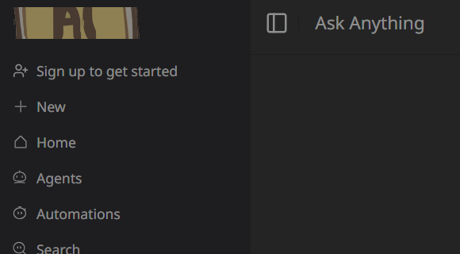

Rajat Singh - Khoj AI Rebranding Assignment
===========================================

This is a personalized version of the Khoj AI open-source project. I have completed the required modifications by replacing all instances of the "Khoj AI" name and lantern logo with my own branding.


---

✅ What Has Been Done
-----------------------

1. **Name Rebranding**
   - Replaced all occurrences of "Khoj" and "Khoj AI" with "Rajat Singh".
   - Updated text in UI components, metadata, manifest files, and browser titles.

2. **Logo Replacement**
   - Replaced the original lantern icon used across:
     - Favicon (.ico)
     - App Icons (128x128, 256x256, 512x512, 1200x1200)
     - Social preview image (1200x630)
   - Updated SVG logo inside `khojLogo.tsx`.

3. **File and Asset Updates**
   - Navigated to `khoj/src/interface/web/public/assets/icons/` and replaced all `khoj_lantern_*.png` and `.ico` files with custom branded files.
   - Also updated OpenGraph and manifest image URLs.

4. **Code Cleanup**
   - Used VS Code global search to ensure all occurrences of "Khoj" were replaced.
   - Verified name/logo replacements in:
     - Manifest files
     - Metadata definitions
     - Component imports and UI rendering

---

🖼️ Proof of Work (Screenshots)
-------------------------------
Please insert the following screenshots below this section:

1. **App Header** with "Rajat Singh " name and custom logo  
   


2. **Favicon in Browser Tab** showing the new `.ico`  
   

3. **Manifest Preview** in browser dev tools  
   


---

📦 How to Run the Project
--------------------------

```bash
# Clone the repo
https://github.com/rajatsingh23/khoj

# Create, Activate Virtual Environment
python3 -m venv .venv && .venv\Scripts\activate

# Install Khoj for Development
pip install -e '.[dev]'

#Create Database
createdb -U postgres khoj --password

#Build the frontend
cd src/interface/web/
yarn install

#Run the frontend
yarn dev
